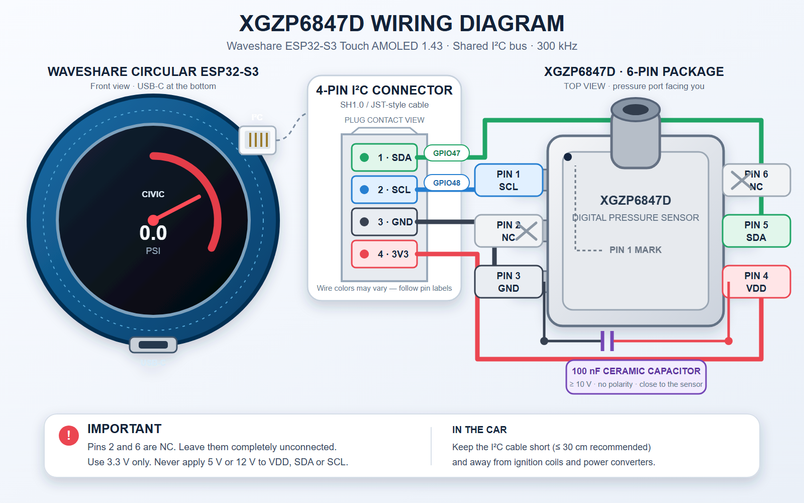

# Reloj de presión de turbo para Civic con ESP32-S3

**Español** | [English](README.md)

Reloj de presión de turbo para la Waveshare
ESP32-S3-Touch-AMOLED-1.43. La interfaz está diseñada para la pantalla AMOLED
de 466x466 con el conector USB orientado hacia abajo.

La versión de producción actual es la **v1.3.0**, con el sensor digital de
presión XGZP6847D probado en hardware y la ruta táctil FT3168 estable sobre el
bus I2C compartido.

El renderizador utiliza elementos visuales pregenerados y una caché del reloj
creada durante la compilación para mantener actualizaciones fluidas a 60 Hz.
La caché de 4,90 MB se almacena en el firmware como un recurso zlib de 465 KB,
se valida y se descomprime directamente en PSRAM durante la pantalla de
arranque. Antes de mostrar las lecturas reales se ejecuta un barrido inicial.

## Demostración del reloj en PSI


## Demostración del reloj en BAR


## Pantalla de arranque


## Características

- Escala seleccionable: de -15 a 30 PSI o de -1 a 2 BAR.
- PSI es la unidad predeterminada y la selección se conserva tras reiniciar.
- Color del arco con transición suave en función de la presión.
- Arco, cursor, números y logotipo renderizados desde caché.
- Formato de caché versionado y validado mediante tamaño, ABI y CRC.
- Pantalla Honda/Civic de cinco segundos y barrido inicial.
- Toque sobre el logotipo Civic para activar o desactivar el modo SHOW.
- Pulsación larga sobre el logotipo para abrir unidades, brillo, offset,
  temperatura del sensor y smoothing.
- Selector persistente `EN`/`ES` que traduce inmediatamente todo el menú sin
  reiniciar.
- Offset persistente de -1,5 a +1,5 PSI en pasos de 0,1 PSI, con conversión
  coherente cuando el reloj muestra BAR.
- Procesamiento seleccionable sin smoothing, mediante EMA configurable o
  mediante One Euro configurable, con restauración de valores predeterminados.
- Brillo inicial del 75 % y ajustes persistentes desde el menú.
- Lectura digital de presión y temperatura del XGZP6847D probada en hardware.
- Aviso visible `ERR` después de un segundo sin una lectura válida.
- Aviso visible `MAX` cuando la presión supera el límite visual de 30 PSI.

## Sensor de presión

El sensor de turbo es el **XGZP6847D300KPGPN I2C**, con rango bidireccional de
`-100 a +300 kPa`. Funciona a 3,3 V, utiliza la dirección `0x6D` y el factor de
transferencia `K=16` de la documentación V2.x. El firmware lo muestrea de forma
independiente hasta 100 Hz y convierte el resultado con signo de 24 bits a kPa
canónicos. El smoothing seleccionado se aplica en kPa, seguido del offset
opcional y de la conversión a PSI o BAR. El renderizador conserva su
planificación independiente de 60 Hz.

### Cero atmosférico y offset de visualización

El XGZP6847D es un sensor de presión relativa calibrado de fábrica. Su
referencia es la presión atmosférica; por ello, cuando el lado de medición
también está abierto a la misma atmósfera, el propio sensor ya entrega
aproximadamente `0 kPa` (`0 PSI`). Este cero atmosférico procede del sensor y
de su referencia física. El firmware no captura ni resta un cero nuevo durante
el arranque. El
[datasheet oficial de CFSensor](https://cfsensor.com/wp-content/uploads/2022/11/XGZP6847D-Pressure-Sensor-V3.0.pdf)
identifica `GPN` como el tipo de presión relativa negativa y positiva e incluye
la variante de `-100 a +300 kPa` empleada por este proyecto.

Un cero automático por software sería perjudicial en un coche. Si el reloj
arrancase mientras el motor genera vacío en el colector o presión de turbo, esa
presión real podría confundirse con cero y desplazar todas las lecturas
posteriores. Para mostrar la presión física del colector, deja `AJUSTE` en su
valor predeterminado de `+0.0 PSI`.

> **Importante:** no utilices `AJUSTE` para poner a cero un sensor correctamente
> instalado y abierto al aire. El sensor ya establece su cero atmosférico.
> Utiliza el offset únicamente cuando quieras igualar deliberadamente el valor
> calculado internamente por el coche.

El control persistente `AJUSTE` no es, por tanto, una calibración del sensor.
Su finalidad es alinear o simular deliberadamente el valor de turbo calculado
por el coche o mostrado mediante un dato compatible de la ECU/OBD. Permite
sumar o restar hasta `1,5 PSI` en pasos de `0,1 PSI`. Úsalo sólo después de
confirmar que el valor comparado es presión relativa de turbo y no presión MAP
absoluta. No puede convertir presión absoluta en relativa ni corregir un error
de escala, manguito o rango de sensor.

El offset se aplica después del smoothing y antes de convertir a PSI/BAR, por
lo que la corrección es coherente en ambas unidades. Una pequeña zona muerta
visual muestra como cero los valores dentro de `±0,25 PSI` o `±0,02 bar`.
Esta zona sólo evita parpadeo visual: no recalibra ni modifica el cero del
sensor.

### Suavizado de presión

El smoothing reduce el movimiento visible del número y de la aguja causado por
el ruido normal entre muestras. No calibra la presión, no cambia el cero
atmosférico y no reduce la frecuencia de adquisición del sensor. `SIN` utiliza
cada muestra válida sin suavizado temporal. `EMA` ofrece una respuesta sencilla
y configurable, mientras que `1 EURO` suaviza más intensamente los cambios
lentos y responde con mayor rapidez ante variaciones rápidas de turbo.

El editor persistente permite ajustar el alfa de EMA entre `0,05` y `1,00` en
pasos de `0,05` (valor inicial `0,35`). One Euro permite una frecuencia de corte
mínima de `0,5` a `5,0 Hz` en pasos de `0,1 Hz` (valor inicial `2,0 Hz`) y una
beta de `0,00` a `3,00` por kPa en pasos de `0,05` (valor inicial `1,00`). El
corte del filtro de la derivada permanece fijo en `1 Hz`. `RESTAURAR` recupera
los valores iniciales sin cambiar el modo seleccionado. El modo y sus valores
se conservan tras reiniciar.

Consulta [Configuración de presión, offset y smoothing](docs/pressure-settings.es.md)
para ver la explicación detallada, el procedimiento recomendado de ajuste y
ejemplos prácticos.

Selecciona `EN` o `ES` en la parte superior del menú para cambiar el idioma.
La elección queda guardada tras reiniciar. Las unidades, los valores numéricos
y los indicadores universales `ERR`/`MAX` no cambian.

La visualización de la temperatura interna del sensor está desactivada de
forma predeterminada y puede habilitarse permanentemente con `TEMP: SI/NO`.
Cuando está activa, la lectura grande aparece entre el logotipo Civic y la
unidad de presión y se actualiza cada cinco segundos.

Las lecturas inválidas, antiguas o ausentes no bloquean el firmware y muestran
`ERR` después de un segundo. El sensor vuelve a buscarse periódicamente tras
un fallo del bus. La presión superior al límite visual de 30 PSI se limita de
forma segura y se marca con `MAX`. Las compilaciones de producción mantienen
desactivada la telemetría continua de sensor y táctil; los mensajes de arranque,
error y recuperación siguen disponibles por USB serie.

## Hardware

- Waveshare ESP32-S3-Touch-AMOLED-1.43.
- XGZP6847D300KPGPN conectado al bus I2C compartido en GPIO 47/48.
- VDD del sensor conectado a 3,3 V.
- Masa común entre el sensor y el ESP32-S3.

## Cableado



Utiliza el conector I2C SH1.0 de cuatro contactos de la placa. El orden de los
contactos y la correspondencia con el sensor son:

| Conector Waveshare | Señal | Pin del XGZP6847D |
| --- | --- | --- |
| Pin 1 | SDA / GPIO 47 | Pin 5 / SDA |
| Pin 2 | SCL / GPIO 48 | Pin 1 / SCL |
| Pin 3 | GND | Pin 3 / GND |
| Pin 4 | 3V3 | Pin 4 / VDD |

Deja los pines 2 y 6 del XGZP6847D completamente desconectados. Coloca un
condensador cerámico de 100 nF y al menos 10 V entre los pines 4 (VDD) y
3 (GND), tan cerca del sensor como resulte práctico. El condensador no tiene
polaridad. Los colores del cable pueden variar; sigue la numeración de los
contactos y no te bases únicamente en el color.

El diagrama vectorial editable está disponible en
[`docs/xgzp6847d-wiring-diagram.svg`](docs/xgzp6847d-wiring-diagram.svg).

El FT3168 integrado utiliza el método de lectura agrupada de Waveshare sobre el
bus compartido a 300 kHz: modo normal, una lectura del número de dedos y una
lectura agrupada de X/Y por toque activo. El modo de alimentación activo se
refresca cada segundo y se impide la entrada automática en monitor porque la
inicialización aislada de la demostración puede dejar de responder en el bus
compartido real.

El sensor y las resistencias pull-up del I2C deben permanecer a 3,3 V. No
apliques 5 V a las líneas SDA o SCL.

## Descarga del firmware

Descarga el paquete completo v1.3.0 desde la
[página de la versión en GitHub](https://github.com/kytos22/esp32-s3-civic-boost-gauge/releases/tag/v1.3.0).
Utiliza la imagen completa en la dirección `0x0` para una instalación completa.
Usa la imagen de sólo aplicación en `0x10000` únicamente si la placa ya tiene
el bootloader y la tabla de particiones correspondientes. Verifica los archivos
descargados con `SHA256SUMS.txt`.

## Compilación

El proyecto incluye las versiones exactas de las bibliotecas utilizadas por el
firmware funcional. Instala PlatformIO, abre este directorio y ejecuta:

```powershell
pio run
```

Para cargar el firmware a través de un puerto serie específico:

```powershell
pio run --target upload --upload-port COM6
```

## Guía de desarrollo

Los colaboradores y agentes de programación deben leer
[`AGENTS.es.md`](AGENTS.es.md) antes de modificar el renderizador, la
transferencia de pantalla, el mapeo táctil, los recursos generados o la ruta
del sensor. Ese documento recoge la arquitectura verificada, sus invariantes y
los procesos de validación empleados en el proyecto.

La instantánea validada del renderizador se documenta en
[`GOLDEN_VERSION.es.md`](GOLDEN_VERSION.es.md). Las imágenes del firmware
v1.3.0 y las dos demostraciones del reloj se encuentran en `firmware/1.3.0/`.

## Caché pregenerada

`tools/prebaked_gauge_cache.bin` es la caché canónica capturada desde el
renderizador sin artefactos. Antes de compilar, `tools/platformio_prebuild.py`
comprueba si ha cambiado y ejecuta `tools/generate_prebaked_cache.py` cuando es
necesario actualizar el recurso C++ comprimido.

Para regenerar la caché canónica después de modificar la geometría o los
colores del reloj:

1. Establece `DUMP_BAKED_CACHE` a `1` en `src/main.cpp`.
2. Compila y carga el firmware exportador temporal.
3. Ejecuta `python tools/capture_prebaked_cache.py --port COM6`.
4. Vuelve a establecer `DUMP_BAKED_CACHE` a `0`.
5. Compila normalmente; PlatformIO regenerará el recurso comprimido.

La herramienta de captura valida la cabecera y el CRC antes de sustituir el
archivo canónico. El firmware normal nunca genera la geometría de la caché
durante la ejecución.

## Notas

Los nombres y logotipos Honda y Civic son marcas registradas de Honda Motor
Co., Ltd. Este es un proyecto independiente de aficionados y no está afiliado
ni respaldado por Honda.
