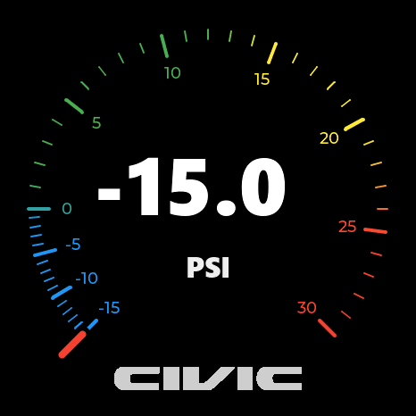
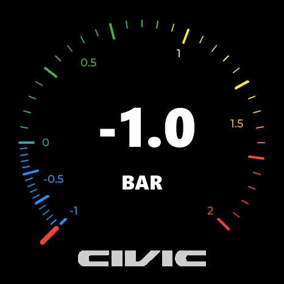

# ESP32-S3 Civic Boost Gauge

Turbo boost gauge for the Waveshare ESP32-S3-Touch-AMOLED-1.43. The interface
is designed for the 466x466 AMOLED with the USB connector facing down.

The renderer uses pre-generated static visuals and a build-time gauge cache for
smooth 60 Hz updates. The 4.90 MB cache is stored in the firmware as a 465 KB
zlib asset, validated and decompressed directly into PSRAM during the startup
screen. An initial sweep runs before live sensor readings begin.

## PSI gauge demo



## BAR gauge demo



## Boot screen


## Features

- Selectable gauge range: -15 to 30 PSI or -1 to 2 BAR.
- PSI is the default; the selected unit is saved across restarts.
- Smooth pressure-dependent arc color.
- Prebaked arc, cursor, number and logo rendering.
- Versioned cache format with size, ABI and CRC validation.
- Five-second Honda/Civic startup screen and initial sweep.
- Capacitive touch on the Civic logo to toggle SHOW mode.
- Long press on the Civic logo for unit selection, brightness and the
  persistent sensor-temperature switch.
- 75% default display brightness with persistent menu adjustments.
- Hardware-tested XGZP6847D digital pressure and temperature acquisition.

## Pressure sensor

The turbo sensor is the **XGZP6847D300KPGPN I2C**, using the bidirectional
`-100 to +300 kPa` range. It is powered from 3.3 V, uses address `0x6D` and the
V2.x `K=16` transfer factor. The firmware samples it independently at up to
100 Hz, converts its signed 24-bit result to kPa, filters the canonical pressure
and then updates the active PSI or BAR display while the renderer remains at
60 Hz.

The factory-calibrated digital pressure value is used directly; there is no
software zero calibration at startup or in the menu. The sensor's internal
temperature display is disabled by default and can be enabled permanently with
the menu's `TEMP: OFF/ON` button. When enabled, its large readout is shown
between the Civic logo and pressure unit and is refreshed every five seconds.
Invalid, stale or missing readings safely resolve to zero without blocking the
display, and the sensor is periodically reprobed after a bus failure. Pressure,
temperature and error counters are available over USB serial for hardware
validation.

## Hardware

- Waveshare ESP32-S3-Touch-AMOLED-1.43.
- XGZP6847D300KPGPN connected to the shared I2C bus on GPIO 47/48.
- Sensor VDD connected to 3.3 V.
- Common ground between the sensor and the ESP32-S3.

The onboard FT3168 uses Waveshare's grouped polling method on the 300 kHz shared
bus: normal mode, one finger-count read and one grouped X/Y read per active
touch. Active power mode is refreshed every second and automatic monitor entry
is disabled because the pure demo initialization can stop acknowledging reads
on the shared live bus.

The sensor and I2C pull-ups must remain at 3.3 V. Do not apply 5 V to the SDA
or SCL lines.

## Build

The project includes the exact library versions used by the working firmware.
Install PlatformIO, open this directory and run:

```powershell
pio run
```

To upload to a specific serial port:

```powershell
pio run --target upload --upload-port COM6
```

## Development guide

Coding agents and contributors should read [`AGENTS.md`](AGENTS.md) before
changing the renderer, display transfer, touch mapping, generated assets or
sensor path. It documents the verified architecture, invariants and validation
workflows used by this project.

The validated renderer snapshot is documented in `GOLDEN_VERSION.md`. Version
1.2 firmware images and both gauge GIFs are in `firmware/1.2.0/`.

## Prebaked cache

`tools/prebaked_gauge_cache.bin` is the canonical cache captured from the
artifact-free renderer. Before compilation, `tools/platformio_prebuild.py`
checks whether it changed and runs `tools/generate_prebaked_cache.py` when the
compressed C++ asset needs to be refreshed.

To regenerate the canonical cache after changing gauge geometry or colors:

1. Set `DUMP_BAKED_CACHE` to `1` in `src/main.cpp`.
2. Build and upload the temporary exporter.
3. Run `python tools/capture_prebaked_cache.py --port COM6`.
4. Set `DUMP_BAKED_CACHE` back to `0`.
5. Build normally; PlatformIO regenerates the compressed firmware asset.

The capture tool validates the binary header and CRC before replacing the
canonical file. Normal firmware never performs the geometric cache generation.

## Notes

Honda and Civic names and logos are trademarks of Honda Motor Co., Ltd. This is
an independent enthusiast project and is not affiliated with or endorsed by
Honda.
